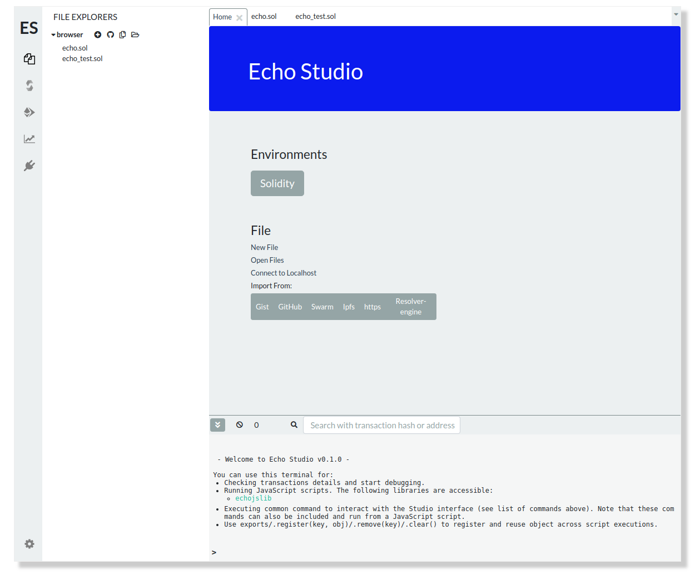

# Echo Studio


Echo Studio is a browser-based compiler and IDE that enables users to build **Echo contracts with Solidity language**, to debug transactions  and to interact with the [Echo](httpd://echo.org) blockchain



## Installation Prerequisites

Before installing, [download and install Node.js](https://nodejs.org/en/download/).
Node.js 8.x.x or higher is required.

## Install Echo Studio from github source:

Use the following steps to install the wallet from github source:

Clone the git repository:

```bash
git clone https://github.com/echoprotocol/echo-studio.git
```

Go into the `echo-studio` repository:

```bash
cd echo-studio
```

Use the package manager [npm](https://www.npmjs.com/) to install dependencies:

```bash
npm install
```

Update the registered submodules:
```
git submodule update --init --recursive
```
Go into the tools sumbmodule:
```bash
cd tools
```

Install `tools` dependencies:

```bash
npm install
```

Bootstrap the packages in the `tools` repository:

```bash
npm run bootstrap
```

Go back into the `echo-studio` repository:

```bash
cd ..
```

Setup `tools` in the `echo-studio` repository:

```bash
npm run setupstudio
```

This starts the process in development mode and starts a webpack dev server:

```bash
npm run start
```

This will launch the Echo Studio at http://localhost:8080

## Building the Echo Studio for Production

If you want builds the wallet for production to the `dist` folder run this command:

```bash
npm run build_production
```

## Lint

To [lint](https://eslint.org/) your `*.js` and `*.jsx` files run this command:

```bash
npm run lint
```

## Troubleshooting building

Some things to consider if you have trouble building the package:

- Make sure that you have the correct version of `node`.

	Run:

	```bash
	node --version
	```

- In Debian based OS such as Ubuntu 14.04LTS you may need to run `apt-get install build-essential`. After installing `build-essential` run `npm rebuild`.


## Contributing

Read our [Contributing Guide](https://github.com/echoprotocol/echo-studio/CONTRIBUTING.md) to learn about our development process, how to propose bugfixes and improvements.

## License

The MIT License (MIT)

Copyright (c) 2019 ECHO DEVELOPMENT LTD

Copyright (c) 2014, 2015, 2019 the individual contributors


Permission is hereby granted, free of charge, to any person obtaining a copy of
this software and associated documentation files (the "Software"), to deal in
the Software without restriction, including without limitation the rights to
use, copy, modify, merge, publish, distribute, sublicense, and/or sell copies of
the Software, and to permit persons to whom the Software is furnished to do so,
subject to the following conditions:

The above copyright notice and this permission notice shall be included in all
copies or substantial portions of the Software.

THE SOFTWARE IS PROVIDED "AS IS", WITHOUT WARRANTY OF ANY KIND, EXPRESS OR
IMPLIED, INCLUDING BUT NOT LIMITED TO THE WARRANTIES OF MERCHANTABILITY, FITNESS
FOR A PARTICULAR PURPOSE AND NONINFRINGEMENT. IN NO EVENT SHALL THE AUTHORS OR
COPYRIGHT HOLDERS BE LIABLE FOR ANY CLAIM, DAMAGES OR OTHER LIABILITY, WHETHER
IN AN ACTION OF CONTRACT, TORT OR OTHERWISE, ARISING FROM, OUT OF OR IN
CONNECTION WITH THE SOFTWARE OR THE USE OR OTHER DEALINGS IN THE SOFTWARE.
